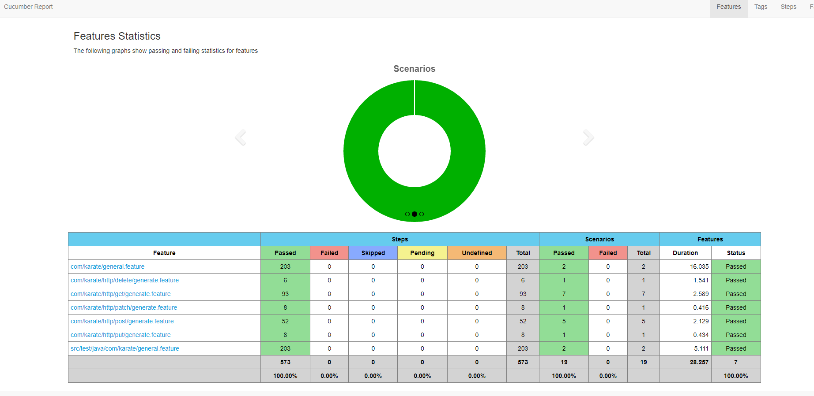

# API Testing with Karate DSL Framework Automation

### Versión 1 Ready! 573 Steps

### Methods GET, PUT, POST, PATCH, DELETE and functions with JavaScript and Java

---

---

### By Edwin Andres Chivata Neira https://www.linkedin.com/in/edwincneira/
